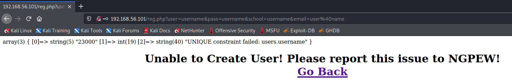
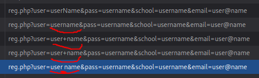

Make sure to keep spoilers out of the titles as much as you can. 

* Issue Title [Needs to fit in a tweet]

**Duplicate User Registration: unable to register new user with existing name.**

* Issue Short Description

**Registering a user with a name that already exists prompts a message to `Report this issue to NGPEW`.**

* Issue Steps to Reproduce in Long Form

**Open a web browser and navigate to the IP of the NGPEW sensor server. Once there, click `Create New Account` and continue with making a user. Once complete, redo the steps taken with the same information and the server will print an error saying `Unable to Create User! Please report this issue to NGPEW!`.**

* Issue Security Risks to the End User

**With a simple Python script, a malicious user could easily take up popular names and prevent legitimate users from making accounts.**

* Issue Security Risks to NGPEW

**This account spam cannot only prevent users, but possible the system itself considering the server only has 1GB of RAM, it could be maxed out quickly if a malicious user makes enough requests to DDoS the server. This prevents the graphs from being read and thus possible for a sensor to reach dangerous levels and NGPEW would not be able to know since the web interface is unresponsive.**

* Credits, Usernames, Github Repo, Sources.

**Anthony Hallak, https://anthony.hallak.net**

* Any other Details

**Thanks to Forrest (@JRWR) for making these badges!**

If you wish to include any files, please attach a PR into a subfolder of the writeups folder in this repo. Please use the format writeups/\<username>/\<issue title>
